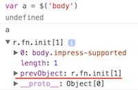

学习了 prevObject 之后发现，我之前写的一篇博客介绍 pushStack 函数那个内容是有问题的。本来我以为这个 pushStack 函数就是一个普通的函数，它接受一个 DOM （数组）参数，把该参数合并到一个 jQuery 对象中并返回该 jQuery 对象。

后来我也疑惑过一段时间，为什么看不到这个函数的使用，而且为什么要把它放到 jQuery.fn 上，直到今天，才恍然大悟。

## jQuery 的 prevObject 对象

当我们新建一个 jQuery 对象的时候，都会在其属性中发现一个 `prevObject` 的属性，如果单单从名字来看的，“前一个对象”，那么它到底是怎么用的呢。



在 jQuery 对象的内部，有着一个 jQuery 对象栈，用来维护所有已经操作过的 jQuery 对象。这样子的话可以写出很流畅的 jQuery 代码，比如操作父元素，操作子元素，再回到父元素的时候就很方便。不过在使用的时候，都是忽略对象栈而定义不同的 jQuery 对象来指向父元素和子元素，比如：

```html
<div id="view">
  <h1 class="header">标题</h1>
  <p>container</p>
  <strong class="espe">重点</strong>
</div>
```

对于上面的 html：

```javascript
var $view = $("#view");
// $header 是由 $view 操作得到的
var $header = $view.find('header');
$header.prevObject === $view; // true
```

但实际上，这个栈是不存在的，我们知道数组可以当作栈或队列来使用，是不是说 jQuery 内部有这么个数组来存放这个对象栈呢。答案是 no，为什么，因为没必要这么麻烦。这样来想一想，如果每一个 jQuery 对象都

## 参考

>[jQuery 2.0.3 源码分析 回溯魔法 end()和pushStack()](http://www.cnblogs.com/aaronjs/p/3387278.html)

>[jQuery API .end()](http://www.css88.com/jqapi-1.9/end/)

>[jQuery API .addBack()](http://www.css88.com/jqapi-1.9/addBack/)